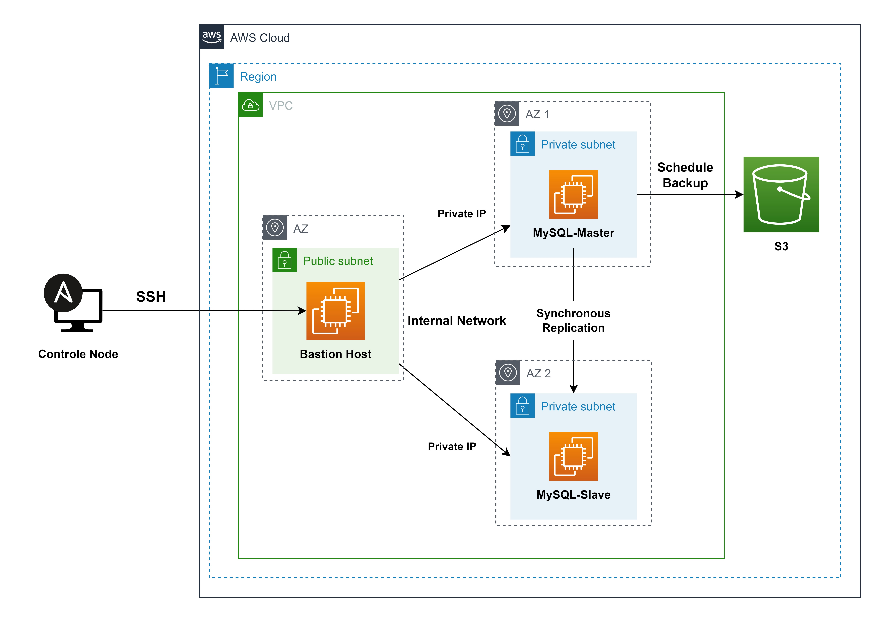

# MySQL Master-Slave Replication with Ansible

This repository contains Ansible roles and a playbook to automate the setup of MySQL Master-Slave replication between two private servers using a bastion host.



## Features

- Automated setup of MySQL Master-Slave replication.
- Roles for common MySQL setup, MySQL master setup, MySQL slave setup, and scheduling backups to S3.
- Flexible configuration options for customization.

## Requirements

- Ansible installed on the local machine.
- SSH key configured for passwordless authentication.
- SSH access to the bastion host, master, and slave servers.

## Usage

1. Update the `inventory.yml` file with the IP addresses of the bastion host, MySQL master, and MySQL slave servers.
2. Ensure the SSH private key file path is correct for the bastion host and servers.
3. Modify variables in `roles/mysql_common/vars/main.yml`, `roles/mysql_master/vars/main.yml`, `roles/mysql_slave/vars/main.yml`, and `roles/schedule_backup/vars/main.yml` as needed.
4. Run the playbook with the following command:

```bash
ansible-playbook -i inventory.yml playbook.yml
```

## Roles

### `mysql_common`

- Installs MySQL packages.
- Ensures MySQL service is enabled and started.
- Sets MySQL root password.
- Adds application user.
- Creates a MySQL database.

### `mysql_master`

- Includes custom MySQL configuration.
- Creates replication user for master.
- Fetches MySQL master status.

### `mysql_slave`

- Includes custom MySQL configuration.
- Sets up MySQL replication slave.
- Configures slave to replicate from the master.

### `schedule_backup`

- Sets up scheduled backups of MySQL databases to Amazon S3.
- Requires AWS credentials configured and the AWS CLI installed on the target machine.

## Configuration

### MySQL Common

Modify the variables in `roles/mysql_common/vars/main.yml` to customize MySQL setup, including root password, application user, and database name.

### MySQL Master

Modify the variables in `roles/mysql_master/vars/main.yml` to customize MySQL master setup, including replication user and password.

### MySQL Slave

Modify the variables in `roles/mysql_slave/vars/main.yml` to customize MySQL slave setup, including replication user, password, and master status.

### Backup to S3

Modify the variables in `roles/schedule_backup/vars/main.yml` to customize backup scheduling and Amazon S3 bucket details.
